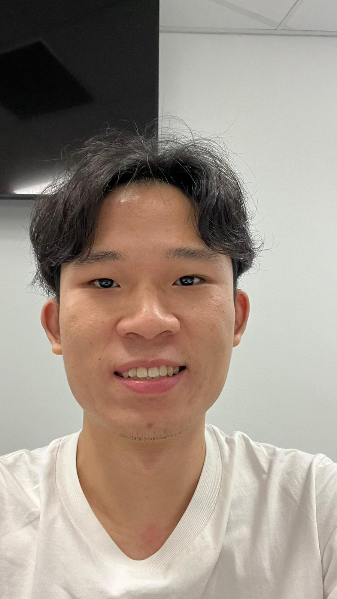
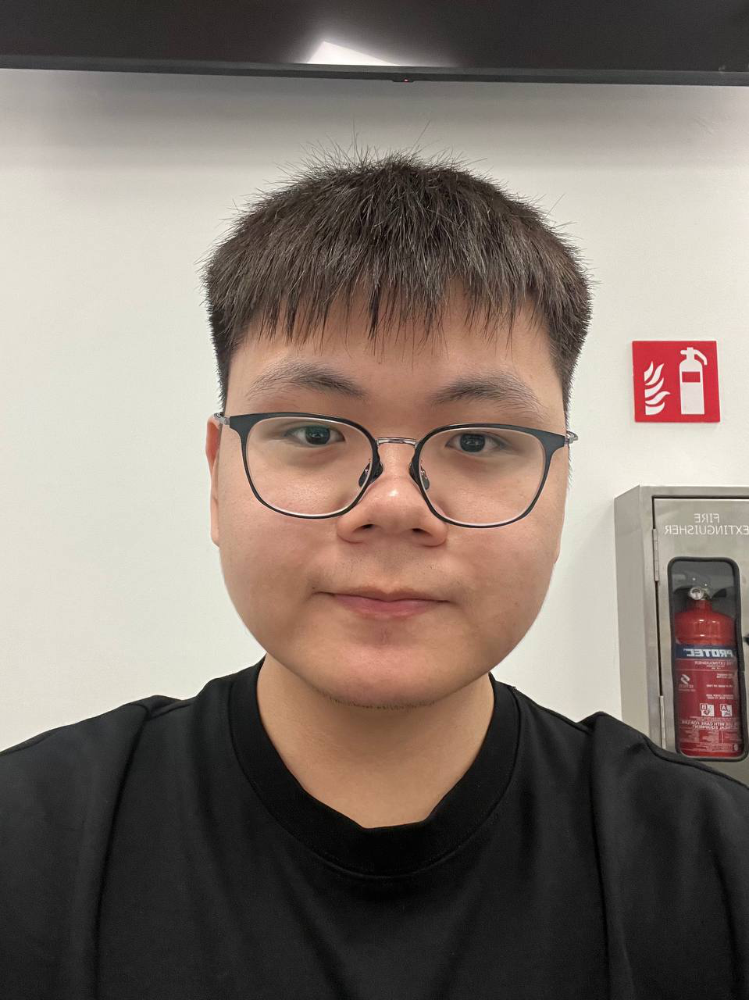

We are a team based in the [School of Computing, National University of Singapore](http://www.comp.nus.edu.sg).

## Project team

### Annamalai Maniveerappan

[[homepage](https://www.linkedin.com/in/annamalai-maniveerappan-b12a60183/)]
[[github](https://github.com/sabersmash1412)]
[[portfolio](https://annamalaimaniveerappan.netlify.app)]

* Role: Developer
* Responsibilities: Ui

### William Liow

[[github](https://github.com/williamoose)]
[[portfolio](https://www.linkedin.com/in/william-liow-a865a41b3/)]

* Role: Developer
* Responsibilities: Testing

### Kee Huang

[[github](http://github.com/CoderKee)]
[[portfolio](team/coderkee.md)]

* Role: Developer
* Responsibilities: Logic

### Ronnie Fun

[[github](http://github.com/ronniefun1)]
[[portfolio](https://www.linkedin.com/in/ronnie-fun-35319a2b6/)]

* Role: Developer
* Responsibilities: Data

### Toh Yan Hui

[[github](http://github.com/tohyanhui)]
[[portfolio](https://www.linkedin.com/in/tohyanhui/)]

* Role: Developer
* Responsibilities: Scheduling and tracking
