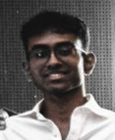

We are a team based in the [School of Computing, National University of Singapore](https://www.comp.nus.edu.sg).

You can reach us at the email `seer[at]comp.nus.edu.sg`

## Project team

### Annamalai Maniveerappan

[[homepage](https://www.linkedin.com/in/annamalai-maniveerappan-b12a60183/)]
[[github](https://github.com/sabersmash1412)]
[[portfolio](https://annamalaimaniveerappan.netlify.app)]

* Role: Developer
* Responsibilities: Ui

### Kee Huang

[[github](http://github.com/CoderKee)]
[[portfolio](team/coderkee.md)]

* Role: Developer
* Responsibilities: Logic

### Johnny Doe

[[github](http://github.com/johndoe)] [[portfolio](team/johndoe.md)]

* Role: Developer
* Responsibilities: Data

### Jean Doe

[[github](http://github.com/johndoe)]
[[portfolio](team/johndoe.md)]

* Role: Developer
* Responsibilities: Dev Ops + Threading

### James Doe

[[github](http://github.com/johndoe)]
[[portfolio](team/johndoe.md)]

* Role: Developer
* Responsibilities: UI
