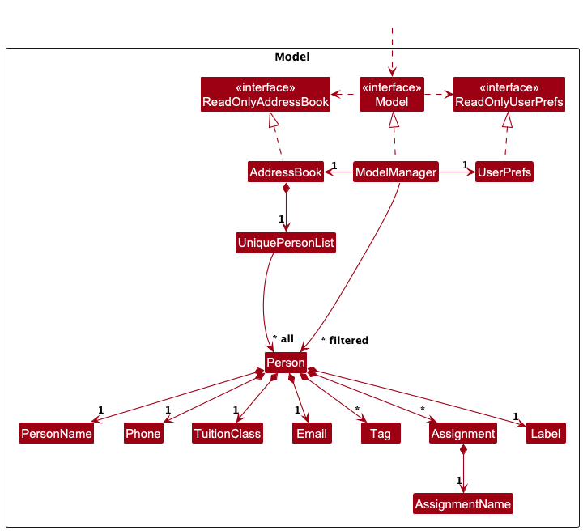

* Table of Contents
{:toc}

--------------------------------------------------------------------------------------------------------------------

## **Acknowledgements**

* This project is based on [AddressBook Level 3 (AB3) project by the SE-EDU initiative.](https://se-education.org/addressbook-level3/)
* Built using JavaFX (maintained by [OpenJDK](https://wiki.openjdk.org/display/OpenJFX)) for the GUI.
* Uses [Jackson](https://github.com/FasterXML/jackson) for JSON data serialization and deserialization.
* Uses [JUnit](https://junit.org) for testing.
* Uses [PlantUML](https://plantuml.com/) for modelling.
* Uses [Gradle](https://gradle.org/) for build automation.

--------------------------------------------------------------------------------------------------------------------

## **Setting up, getting started**

Refer to the guide [_Setting up and getting started_](SettingUp.md).

--------------------------------------------------------------------------------------------------------------------

## **Design**

<div markdown="span" class="alert alert-primary">

:bulb: **Tip:** The `.puml` files used to create diagrams are in this document `docs/diagrams` folder. Refer to the [_PlantUML Tutorial_ at se-edu/guides](https://se-education.org/guides/tutorials/plantUml.html) to learn how to create and edit diagrams.
</div>

### Architecture

<div markdown="span" class="alert alert-primary">:pushpin: **Note:**
Internally, we use AddressBook to represent EduBook, and person to represent student. Some class names inherited from AB3 may be unchanged.
</div>


The ***Architecture Diagram*** given above explains the high-level design of the App.

Given below is a quick overview of main components and how they interact with each other.

**Main components of the architecture**

**`Main`** (consisting of classes [`Main`](https://github.com/AY2526S1-CS2103T-W14-1/tp/tree/master/src/main/java/seedu/edubook/Main.java) and [`MainApp`](https://github.com/AY2526S1-CS2103T-W14-1/tp/tree/master/src/main/java/seedu/edubook/MainApp.java)) is in charge of the app launch and shut down.
* At app launch, it initializes the other components in the correct sequence, and connects them up with each other.
* At shut down, it shuts down the other components and invokes cleanup methods where necessary.

The bulk of the app's work is done by the following four components:

* [**`UI`**](#ui-component): The UI of the App.
* [**`Logic`**](#logic-component): The command executor.
* [**`Model`**](#model-component): Holds the data of the App in memory.
* [**`Storage`**](#storage-component): Reads data from, and writes data to, the hard disk.

[**`Commons`**](#common-classes) represents a collection of classes used by multiple other components.

**How the architecture components interact with each other**

The *Sequence Diagram* below shows how the components interact with each other for the scenario where the user issues the command `delete 1`.


Each of the four main components (also shown in the diagram above),

* defines its *API* in an `interface` with the same name as the Component.
* implements its functionality using a concrete `{Component Name}Manager` class (which follows the corresponding API `interface` mentioned in the previous point.

For example, the `Logic` component defines its API in the `Logic.java` interface and implements its functionality using the `LogicManager.java` class which follows the `Logic` interface. Other components interact with a given component through its interface rather than the concrete class (reason: to prevent outside component's being coupled to the implementation of a component), as illustrated in the (partial) class diagram below.


The sections below give more details of each component.

### UI component

The **API** of this component is specified in [`Ui.java`](https://github.com/AY2526S1-CS2103T-W14-1/tp/tree/master/src/main/java/seedu/edubook/ui/Ui.java) and [`ErrorDisplayable.java`](https://github.com/AY2526S1-CS2103T-W14-1/tp/tree/master/src/main/java/seedu/edubook/ui/ErrorDisplayable.java)


The `UI` component consists of 2 interfaces, Ui and ErrorDisplayable. The `Ui` interface handles changes to the UI upon error-free
outcomes. The `ErrorDisplayable` interface handles error reporting to the user upon unexpected behaviours within Edubook.


The UI consists of a `MainWindow` that is made up of parts e.g.`CommandBox`, `ResultDisplay`, `PersonListPanel`, `StatusBarFooter` etc. All these, including the `MainWindow`, inherit from the abstract `UiPart` class which captures the commonalities between classes that represent parts of the visible GUI.

The `UI` component uses the JavaFx UI framework. The layout of these UI parts are defined in matching `.fxml` files that are in the `src/main/resources/view` folder. For example, the layout of the [`MainWindow`](https://github.com/AY2526S1-CS2103T-W14-1/tp/tree/master/src/main/java/seedu/edubook/ui/MainWindow.java) is specified in [`MainWindow.fxml`](https://github.com/AY2526S1-CS2103T-W14-1/tp/tree/master/src/main/resources/view/MainWindow.fxml)

The `UI` component,

* executes user commands using the `Logic` component.
* listens for changes to `Model` data so that the UI can be updated with the modified data.
* keeps a reference to the `Logic` component, because the `UI` relies on the `Logic` to execute commands.
* depends on some classes in the `Model` component, as it displays `Person` object residing in the `Model`.

### Logic component

**API** : [`Logic.java`](https://github.com/AY2526S1-CS2103T-W14-1/tp/tree/master/src/main/java/seedu/edubook/logic/Logic.java)

Here's a (partial) class diagram of the `Logic` component:


The sequence diagram below illustrates the interactions within the `Logic` component, taking `execute("delete 1")` API call as an example.


<div markdown="span" class="alert alert-info">:information_source: **Note:** The lifeline for `DeleteCommandParser` should end at the destroy marker (X) but due to a limitation of PlantUML, the lifeline continues till the end of diagram.
</div>

How the `Logic` component works:

1. When `Logic` is called upon to execute a command, it is passed to an `AddressBookParser` object which in turn creates a parser that matches the command (e.g., `DeleteCommandParser`) and uses it to parse the command.
1. This results in a `Command` object (more precisely, an object of one of its subclasses e.g., `DeleteCommand`) which is executed by the `LogicManager`.
1. The command can communicate with the `Model` when it is executed (e.g. to delete a person).<br>
   Note that although this is shown as a single step in the diagram above (for simplicity), in the code it can take several interactions (between the command object and the `Model`) to achieve.
1. The result of the command execution is encapsulated as a `CommandResult` object which is returned back from `Logic`.

Here are the other classes in `Logic` (omitted from the class diagram above) that are used for parsing a user command:


How the parsing works:
* When called upon to parse a user command, the `AddressBookParser` class creates an `XYZCommandParser` (`XYZ` is a placeholder for the specific command name e.g., `AddCommandParser`) which uses the other classes shown above to parse the user command and create a `XYZCommand` object (e.g., `AddCommand`) which the `AddressBookParser` returns back as a `Command` object.
* All `XYZCommandParser` classes (e.g., `AddCommandParser`, `DeleteCommandParser`, ...) inherit from the `Parser` interface so that they can be treated similarly where possible e.g, during testing.

### Model component
**API** : [`Model.java`](https://github.com/AY2526S1-CS2103T-W14-1/tp/tree/master/src/main/java/seedu/edubook/model/Model.java)




The `Model` component,

* stores the address book data i.e., all `Person` objects (which are contained in a `UniquePersonList` object).
* stores the currently 'selected' `Person` objects (e.g., results of a search query) as a separate _filtered_ list which is exposed to outsiders as an unmodifiable `ObservableList<Person>` that can be 'observed' e.g. the UI can be bound to this list so that the UI automatically updates when the data in the list change.
* stores a `UserPref` object that represents the user’s preferences. This is exposed to the outside as a `ReadOnlyUserPref` objects.
* does not depend on any of the other three components (as the `Model` represents data entities of the domain, they should make sense on their own without depending on other components)

<div markdown="span" class="alert alert-info">:information_source: **Note:** An alternative (arguably, a more OOP) model is given below. It has a `Tag` list in the `AddressBook`, which `Person` references. This allows `AddressBook` to only require one `Tag` object per unique tag, instead of each `Person` needing their own `Tag` objects.<br>


</div>


### Storage component

**API** : [`Storage.java`](https://github.com/AY2526S1-CS2103T-W14-1/tp/tree/master/src/main/java/seedu/edubook/storage/Storage.java)


The `Storage` component,
* can save both address book data and user preference data in JSON format, and read them back into corresponding objects.
* inherits from both `AddressBookStorage` and `UserPrefStorage`, which means it can be treated as either one (if only the functionality of only one is needed).
* depends on some classes in the `Model` component (because the `Storage` component's job is to save/retrieve objects that belong to the `Model`)

### Common classes

Classes used by multiple components are in the `seedu.edubook.commons` package.

--------------------------------------------------------------------------------------------------------------------

## **Implementation**

This section describes some noteworthy details on how certain features are implemented.

### \[Proposed\] Undo/redo feature

#### Proposed Implementation

The proposed undo/redo mechanism is facilitated by `VersionedAddressBook`. It extends `AddressBook` with an undo/redo history, stored internally as an `addressBookStateList` and `currentStatePointer`. Additionally, it implements the following operations:

* `VersionedAddressBook#commit()` — Saves the current address book state in its history.
* `VersionedAddressBook#undo()` — Restores the previous address book state from its history.
* `VersionedAddressBook#redo()` — Restores a previously undone address book state from its history.

These operations are exposed in the `Model` interface as `Model#commitAddressBook()`, `Model#undoAddressBook()` and `Model#redoAddressBook()` respectively.

Given below is an example usage scenario and how the undo/redo mechanism behaves at each step.

Step 1. The user launches the application for the first time. The `VersionedAddressBook` will be initialized with the initial address book state, and the `currentStatePointer` pointing to that single address book state.


Step 2. The user executes `delete 5` command to delete the 5th person in the address book. The `delete` command calls `Model#commitAddressBook()`, causing the modified state of the address book after the `delete 5` command executes to be saved in the `addressBookStateList`, and the `currentStatePointer` is shifted to the newly inserted address book state.


Step 3. The user executes `add n/David …​` to add a new person. The `add` command also calls `Model#commitAddressBook()`, causing another modified address book state to be saved into the `addressBookStateList`.


<div markdown="span" class="alert alert-info">:information_source: **Note:** If a command fails its execution, it will not call `Model#commitAddressBook()`, so the address book state will not be saved into the `addressBookStateList`.

</div>

Step 4. The user now decides that adding the person was a mistake, and decides to undo that action by executing the `undo` command. The `undo` command will call `Model#undoAddressBook()`, which will shift the `currentStatePointer` once to the left, pointing it to the previous address book state, and restores the address book to that state.


<div markdown="span" class="alert alert-info">:information_source: **Note:** If the `currentStatePointer` is at index 0, pointing to the initial AddressBook state, then there are no previous AddressBook states to restore. The `undo` command uses `Model#canUndoAddressBook()` to check if this is the case. If so, it will return an error to the user rather
than attempting to perform the undo.

</div>

The following sequence diagram shows how an undo operation goes through the `Logic` component:


<div markdown="span" class="alert alert-info">:information_source: **Note:** The lifeline for `UndoCommand` should end at the destroy marker (X) but due to a limitation of PlantUML, the lifeline reaches the end of diagram.

</div>

Similarly, how an undo operation goes through the `Model` component is shown below:


The `redo` command does the opposite — it calls `Model#redoAddressBook()`, which shifts the `currentStatePointer` once to the right, pointing to the previously undone state, and restores the address book to that state.

<div markdown="span" class="alert alert-info">:information_source: **Note:** If the `currentStatePointer` is at index `addressBookStateList.size() - 1`, pointing to the latest address book state, then there are no undone AddressBook states to restore. The `redo` command uses `Model#canRedoAddressBook()` to check if this is the case. If so, it will return an error to the user rather than attempting to perform the redo.

</div>

Step 5. The user then decides to execute the command `list`. Commands that do not modify the address book, such as `list`, will usually not call `Model#commitAddressBook()`, `Model#undoAddressBook()` or `Model#redoAddressBook()`. Thus, the `addressBookStateList` remains unchanged.


Step 6. The user executes `clear`, which calls `Model#commitAddressBook()`. Since the `currentStatePointer` is not pointing at the end of the `addressBookStateList`, all address book states after the `currentStatePointer` will be purged. Reason: It no longer makes sense to redo the `add n/David …​` command. This is the behavior that most modern desktop applications follow.


The following activity diagram summarizes what happens when a user executes a new command:


#### Design considerations:

**Aspect: How undo & redo executes:**

* **Alternative 1 (current choice):** Saves the entire address book.
  * Pros: Easy to implement.
  * Cons: May have performance issues in terms of memory usage.

* **Alternative 2:** Individual command knows how to undo/redo by
  itself.
  * Pros: Will use less memory (e.g. for `delete`, just save the person being deleted).
  * Cons: We must ensure that the implementation of each individual command are correct.

_{more aspects and alternatives to be added}_

### Label/Unlabel feature

#### Implementation

The proposed label/unlabel mechanism is facilitated by `EduBook`. Additionally, it implements the following operations:

* `EduBook#label()` — Adds a label for a person.
* `Edubook#unlabel()` — Removes a label for a person.
* `Edubook#edit()` — Edit the contents of a label of a person.

These operations are exposed in the `Model` interface as `Model#commitAddressBook()`, `Model#undoAddressBook()` and `Model#redoAddressBook()` respectively.

Given below is an example usage scenario and how the label/unlabel mechanism behaves at each step.

Step 1. The user launches the application for the first time. The `EduBook` will be initialized with the initial EduBook state.


Step 2. The user executes `label n/John Doe l/Late for class` command to label John Doe in the EduBook. 


Step 3. The user executes `edit n/John Doe l/Serve detention` to edit the label from `Late for class` to `Serve detention`.


Step 4. The user executes `unlabel n/John Doe` to remove the label.


The following sequence diagram shows how a label operation goes through the `Logic` component:


#### Design considerations:

**Aspect: How label & unlabel executes:**

{TBC}


--------------------------------------------------------------------------------------------------------------------

## **Documentation, logging, testing, configuration, dev-ops**

* [Documentation guide](Documentation.md)
* [Testing guide](Testing.md)
* [Logging guide](Logging.md)
* [Configuration guide](Configuration.md)
* [DevOps guide](DevOps.md)

--------------------------------------------------------------------------------------------------------------------

## **Appendix: Requirements**

### Product scope

**Target user profile**:

* is a tutor who manages 10–30 students across multiple classes
* has a need to manage a significant number of student records (attendance, assignments, etc.)
* prefers desktop apps over mobile/web alternatives
* can type fast and prefers typing over mouse interactions
* is reasonably comfortable using CLI apps
* currently relies on spreadsheets/manual tracking but wants a faster, more organized system

**Value proposition**:

Tutors, without established systems, can use EduBook to efficiently keep track of information regarding students and classes (e.g., assignments completion and attendance) using a fast CLI-based workflow, faster than typical mouse/GUI-driven apps.


### User stories

Priorities: High (must have) - `* * *`, Medium (nice to have) - `* *`, Low (unlikely to have) - `*`

| Priority | As a …​       | I want to …​                                           | So that I can…​                                                           |
|----------|---------------|--------------------------------------------------------|---------------------------------------------------------------------------|
| `* * *`  | tutor         | add a student to EduBook                               | keep track of their information                                           |
| `* * *`  | tutor         | delete a student from EduBook                          | remove an entry for a past student                                        |
| `* * *`  | tutor         | view a student’s details                               | review their information quickly                                          |
| `* * *`  | tutor         | create assignments without deadlines                   | track time-insensitive assignments                                        |
| `* * *`  | tutor         | assign an assignment to a student                      | track and manage their assignment                                         |
| `* * *`  | tutor         | unassign an assignment from a student                  | reduce clutter once their assignment is completed and no longer needed    |
| `* * *`  | user          | exit the app                                           | close EduBook safely and end my session                                   |
| `* *`    | new user      | clear all my data after trying out the app             | start with a clean slate                                                  |
| `* *`    | new user      | have a helper that introduces me to the app's features | better understand how to use the app                                      |
| `* *`    | tutor         | mark assignments as done                               | keep track of assignment completion                                       |
| `* *`    | tutor         | mark assignments as not done                           | keep track of assignment incompletion                                     |
| `* *`    | tutor         | view all of my students' information and assignments   | review overall information when needed                                    |
| `* *`    | tutor         | search for a student by name                           | find their record without browsing manually                               |
| `* *`    | tutor         | add a note to a student                                | keep additional information for reference                                 |
| `* *`    | tutor         | remove a note from a student                           | clear notes that are no longer relevant                                   |
| `* *`    | tutor         | edit a student’s details                               | update their information when changes occur                               |
| `* *`    | tutor         | group students                                         | manage group work more easily                                             |
| `* *`    | tutor         | ungroup students                                       | simplify management when groups are no longer needed                      |
| `* *`    | tutor         | assign an assignment in batches                        | send out copies of the assignment to multiple students at once            |
| `* *`    | tutor         | unassign an assignment in batches                      | remove the assignment from multiple students at once efficiently          |
| `* *`    | tutor         | mark assignments as done in batches                    | save time marking multiple students’ assignments as completed at once     |
| `* *`    | tutor         | mark assignments as not done in batches                | save time marking multiple students’ assignments as not completed at once |
| `* *`    | tutor         | add a note to an entire group of students              | keep additional information about the whole group                         |
| `* *`    | tutor         | remove a note from an entire group of students         | clear notes that are no longer relevant for the group                     |
| `* *`    | tutor         | clear an entire group of students                      | remove them when they graduate from my class                              |
| `* *`    | tutor         | clear all students in EduBook                          | reset EduBook for the next academic year                                  |
| `* *`    | tutor         | filter students by assignment assigned                 | view all students assigned to a specific assignment                       |
| `* *`    | tutor         | filter students by group                               | view students belonging to a specific group easily                        |
| `* *`    | tutor         | autosave student details to the local hard disk        | persist data automatically                                                |
| `* *`    | tutor         | retrieve student details from the local hard disk      | reload persisted data                                                     |        
| `* *`    | advanced user | edit the data file directly                            | make bulk changes or fix data outside the app                             |        
| `*`      | tutor         | create assignments with deadlines                      | track time-sensitive assignments                                          |
| `*`      | tutor         | view a list of students’ overdue assignments           | see which assignments my students submitted late                          |
| `*`      | tutor         | filter students by an assignment's completion status   | view which students have completed, are in progress, or are late          |
| `*`      | tutor         | remind myself of assignments with impending deadlines  | better manage assignments                                                 |
| `*`      | tutor         | mark the attendance of a student                       | keep track of whether they turned up for class                            |
| `*`      | tutor         | unmark the attendance of a student                     | correct mistakes in marking their attendance                              |
| `*`      | tutor         | mark a student’s payment status as paid                | keep track that they have paid                                            |
| `*`      | tutor         | mark a student’s payment status as unpaid              | keep track that they have not paid                                        |
| `*`      | tutor         | keep a record of my total pay                          | monitor total payments received from students                             |

### Use cases

For all use cases below, the **System** is the `EduBook` and the **Actor** is the `user`, unless specified otherwise)


**Use case: UC1** - Add a student

**MSS**

1. User requests to add a student. 
2. EduBook adds the student to the list of students.

   Use case ends.

**Extensions**

* 1a. One or more details are missing or invalid (student name, class, phone number, email)
  * 1a1. EduBook informs the user of the invalid input(s).
    
  Use case ends.


* 1b. Student already exists in the list
  * 1b1. EduBook informs the user that the student already exists.

  Use case ends.  


**Use case: UC2** - Remove a student

**MSS**

1. User requests to remove a student.
2. EduBook removes the student from the list of students.

   Use case ends.

**Extensions**

* 1a. One or more details are missing or invalid.
  * 1a1. EduBook informs the user of the invalid input.

  Use case ends.


* 1b. Student does not exist
    * 1b1. EduBook informs the user that the student does not exist.

  Use case ends.


**Use case: UC3** - View a student

**MSS**

1.  User requests to view a student, a class or an assignment.
2.  EduBook checks whether the target is a student, a class or an assignment.
3.  EduBook displays details of the specified student, all students in the specified class 
    or all students with the specified assignment.

    Use case ends.

**Extensions**

* 1a. One or more details are missing or invalid.
  * 1a1. EduBook informs the user of the invalid input.

  Use case ends.


* 2a. Target does not exist
  * 1b1. EduBook informs the user that the student, class or assignment does not exist.

  Use case ends.


**Use case: UC4** - Assign an assignment.

**MSS**

1. Tutor requests to assign an assignment. 
2. EduBook checks whether the target is a student or a class. 
3. EduBook adds the assignment to the specified student or to every student in the specified class.
4. EduBook informs the tutor that the assignment was successfully assigned to the student,
   or for a class, how many students were assigned the assignment and how many were skipped.

   Use case ends.

**Extensions**

* 1a. One or more details are missing or invalid 
    * 1a1. EduBook informs the tutor of the invalid input(s).

  Use case ends.


* 2a. Target does not exist
    * 2a1. EduBook informs the tutor that the student or class does not exist.

  Use case ends.


* 3a. Assignment already assigned to a student
    * 3a1. EduBook informs the tutor that the assignment has already been assigned to the student.

  Use case ends.


* 3b. Assignment already assigned to a class
    * 3b1. EduBook informs the tutor that the assignment has already been assigned to all students in the
      specified class.

  Use case ends.


**Use case: UC5** - Unassign an assignment.

**MSS**

1. Tutor requests to unassign an assignment.
2. EduBook checks whether the target is a student or a class.
3. EduBook removes the assignment from the specified student or from every student in the specified class.
4. EduBook informs the tutor that the assignment was successfully unassigned from the student,
   or for a class, how many students had the assignment unassigned and how many were skipped.

   Use case ends.

**Extensions**

* 1a. One or more details are missing or invalid 
  * 1a1. EduBook informs the tutor of the invalid input(s).

  Use case ends.


* 2a. Target does not exist
  * 2a1. EduBook informs the tutor that the student or class does not exist.

  Use case ends.


* 3a. Assignment already unassigned from a student
  * 3a1. EduBook informs the tutor that the assignment has already been unassigned from the student.

  Use case ends.


* 3b. Assignment already unassigned from a class
  * 3b1. EduBook informs the tutor that the assignment has already been unassigned from all students in the
    specified class.

  Use case ends.


**Use case: UC6** - Mark an assignment.

**MSS**

1. Tutor requests to mark an assignment as completed. 
2. EduBook checks whether the target is a single student or a class. 
3. EduBook updates the assignment status to completed for the student or for all students in the class.
4. EduBook informs the tutor that the assignment was successfully marked for the student, 
   or for a class, how many students' assignments were marked, already marked, or did not have the assignment.

   Use case ends.

**Extensions**

* 1a. One or more details are missing or invalid 
  * 1a1. EduBook informs the tutor of the invalid input(s).

  Use case ends.


* 2a. Target does not exist
  * 2a1. EduBook informs the tutor that the student or class does not exist.
  
  Use case ends.


* 3a. Assignment already marked for a student 
  * 3a1. EduBook informs the tutor that the assignment is already marked.

  Use case ends.


* 3b. Assignment already marked for all students in a class
  * 3b1. EduBook informs the tutor that the assignment is already marked for every student in the specified class.

  Use case ends.


* 3c. Assignment does not exist for a student
  * 3c1. EduBook informs the tutor that the student does not have this assignment.

  Use case ends.


* 3d. Assignment does not exist for a class
  * 3d1. EduBook informs the tutor that all students in the specified class do not have this assignment.

  Use case ends.


* 3e. Mixed case where no assignments are marked for a class:
  some students' assignments are already marked, while some are missing the assignment
  * 3e1. EduBook informs the tutor that no assignments were marked, and reports how many students' assignments were 
    already marked and how many did not exist.

  Use case ends.


**Use case: UC7** - Unmark an assignment.

**MSS**

1. Tutor requests to unmark an assignment as not completed.
2. EduBook checks whether the target is a single student or a class.
3. EduBook updates the assignment status to not completed for the student or for all students in the class.
4. EduBook informs the tutor that the assignment was successfully unmarked for the student,
   or for a class, how many students' assignments were unmarked, already unmarked, or did not have the assignment.

   Use case ends.

**Extensions**

* 1a. One or more details are missing or invalid 
  * 1a1. EduBook informs the tutor of the invalid input(s).

  Use case ends.


* 2a. Target does not exist
  * 2a1. EduBook informs the tutor that the student or class does not exist.

  Use case ends.


* 3a. Assignment already unmarked for a student
  * 3a1. EduBook informs the tutor that the assignment is already unmarked.

  Use case ends.


* 3b. Assignment already unmarked for all students in a class
  * 3b1. EduBook informs the tutor that the assignment is already unmarked for every student in the specified class.

  Use case ends.


* 3c. Assignment does not exist for a student
  * 3c1. EduBook informs the tutor that the student does not have this assignment.

  Use case ends.


* 3d. Assignment does not exist for a class
  * 3d1. EduBook informs the tutor that all students in the specified class do not have this assignment.

  Use case ends.


* 3e. Mixed case where no assignments are unmarked for a class:
  some students' assignments are already unmarked, while some are missing the assignment
  * 3e1. EduBook informs the tutor that no assignments were unmarked, and reports how many students' assignments were
    already unmarked and how many did not exist.

  Use case ends.


**Use case: UC8** - Label a student.

**MSS**

1. User request to label a student.
2. EduBook checks whether the target is a single student or a class.
3. EduBook adds a label to the student or to every student in the class.
4. EduBook informs the tutor that the student was successfully labeled,
   or for a class, how many students were labeled and how many were skipped.

   Use case ends.

**Extensions**

* 1a. One or more details are missing or invalid
    * 1a1. EduBook informs the tutor of the invalid input(s).

  Use case ends.


* 2a. Target does not exist
    * 2a1. EduBook informs the tutor that the student or class does not exist.

  Use case ends.


* 3a. Student already has a label
    * 3a1. EduBook informs the tutor that the student already has a label.

  Use case ends.


* 3b. Every student in the class has a label
    * 3b1. EduBook informs the tutor that every student in the class has a label.

  Use case ends.


**Use case: UC9** - Unlabel a student.

**MSS**

1. User request to unlabel a student.
2. EduBook checks whether the target is a single student or a class.
3. EduBook removes the label from the specified student or from every student in the class.
4. EduBook informs the tutor that the student was successfully unlabeled,
   or for a class, how many students were unlabeled and how many were skipped.

   Use case ends.

**Extensions**

* 1a. One or more details are missing or invalid
    * 1a1. EduBook informs the tutor of the invalid input(s).

  Use case ends.


* 2a. Target does not exist
    * 2a1. EduBook informs the tutor that the student or class does not exist.

  Use case ends.


* 3a. Student does not have a label
    * 3a1. EduBook informs the tutor that the student does not have a label.

  Use case ends.


* 3b. Every student in the class does not have a label
    * 3b1. EduBook informs the tutor that every student in the class does not have a label.

  Use case ends.


### Non-Functional Requirements

1.  Should work on any _mainstream OS_ as long as it has Java `17` or above installed.
2.  Should be able to hold up to 30 students without a noticeable sluggishness in performance for typical usage.
3.  Should be able to load the main interface in under 2 seconds on standard hardware.
4.  A user with above average typing speed for regular English text (i.e. not code, not system admin commands) should be able to accomplish most of the tasks faster using commands than using the mouse.
5.  Finding and viewing operations should complete within 1 second for up to 30 entries.
6.  The user interface should be simple and intuitive for tutors who are less tech-savvy.
7.  Data entered should be auto-saved upon every data changes to prevent loss during unexpected shutdowns.
8.  Font size and UI components should be easily readable for the average user on fullscreen. 
9.  The system should provide clear error messages to guide the user.


### Glossary

* **Mainstream OS**: Windows, Linux, Unix, MacOS
* **Student**: A person receive tutoring lessons from tutors.
* **Tutor**: A person providing tutoring lessons to students.
* **Class**: A grouping of students taught by a tutor.
* **Assignment**: Tasks allocated to the respective student which can marked as completed.
* **Assign**: Allocate assignments to a specific student or class.
* **Mark**: Indicate an assignment as completed.
* **Tag**: A flexible descriptor used to categorise or identify students based on user-defined attributes.
* **Label**: A single, prominent identifier used to mark a student or class with a specific status or classification.
* **View**: Filters the current list of students based on case-insensitive match on name, class or assignment.
* **Find**: Filters the current list of students based on whether the name contains the specific keyword.
* **Keyword**: A full word that is contained inside the student's full name.

--------------------------------------------------------------------------------------------------------------------

## **Appendix: Instructions for manual testing**

Given below are instructions to test the app manually.

<div markdown="span" class="alert alert-info">:information_source: **Note:** These instructions only provide a starting point for testers to work on;
testers are expected to do more *exploratory* testing.

</div>

### Launch and shutdown

1. Initial launch

   1. Ensure you have Java `17` or above installed on your computer.<br>
   To check your version, open a command terminal and run ```java -version```
   2. Download the jar file and copy it into an empty folder
   3. Open a command terminal, `cd` into the folder you put the jar file in, and use the `java -jar edubook.jar` command 
   to run the application.<br>   
   Expected: Shows the GUI with a set of sample students. The window size may not be optimum.

1. Saving window preferences

   1. Resize the window to an optimum size. Move the window to a different location. Close the window.

   1. Re-launch the app by double-clicking the jar file.<br>
   Expected: The most recent window size and location is retained.

1. _{ more test cases …​ }_

### Adding students

1. Adding students with all required fields

    1. Prerequisites: EduBook is open.

    1. Test case: `add n/John Doe p/98765432 e/johnd@example.com c/Class 1-A`<br>
       Expected: Student named "John Doe" is added. Success message displayed.

1. Adding students with tags

    1. Prerequisites: EduBook is open.

    1. Test case: `add n/Bob Tan p/87654321 e/bob@example.com c/Class 3-C t/friend t/club`<br>
       Expected: Student named "Bob Tan" is added with tags "friend" and "club". Success message displayed.

1. Adding students with missing required fields

    1. Prerequisites: EduBook is open.

    1. Test case: `add n/John Doe e/johnd@example.com c/Class 1-A`<br>
       Expected: No student is added. Error message displayed.

1. Adding multiple students in sequence

    1. Prerequisites: EduBook is open.

    1. Test case:
       ```
       add n/John Doe p/98765432 e/johnd@example.com c/Class 1-A
       add n/Jane Smith p/12345678 e/jane@example.com c/Class 2-B
       add n/Bob Tan p/87654321 e/bob@example.com c/Class 3-C t/friend
       ```
       Expected: All three students are added. Success messages displayed for each.


### Deleting students

1. Deleting students by index

   1. Prerequisites: List all students using the `list` command. Multiple students in the list.

   1. Test case: `delete 1`<br>
      Expected: First student is deleted from the list. Success message displayed.

   1. Test case: `delete 0`<br>
      Expected: No student is deleted. Error message displayed.

   1. Other incorrect delete commands to try: `delete`, `delete x`, `...` (where x is larger than the list size)<br>
      Expected: Similar to previous.

1. Deleting students by name

    1. Prerequisites: Student "John Doe" exists in EduBook.

    1. Test case: `delete n/John Doe`<br>
       Expected: Student named "John Doe" is deleted. Success message displayed.

    1. Test case: `delete n/Nonexistent Name`<br>
       Expected: No student is deleted. Error message displayed.

1. Deleting students by class

    1. Prerequisites: At least one student is in class "1A".

    1. Test case: `delete c/1A`<br>
       Expected: All students from class "1A" are deleted. Success message displayed.

    1. Test case: `delete c/Nonexistent Class`<br>
       Expected: No student is deleted. Error message displayed.

### Assigning assignments

1. Assigning an assignment to a student

    1. Prerequisites: Student "John Doe" exists in EduBook. "John Doe" does not have "Homework" assigned.

    1. Test case: `assign a/Homework n/John Doe`<br>
       Expected: "Homework" assigned to John Doe. Success message displayed.

1. Assigning an assignment to a class

    1. Prerequisites: At least one student exists in class "1A" and does not have "Tutorial 1" assigned.

    1. Test case: `assign a/Tutorial 1 c/1A`<br>
       Expected: All students in class "1A" who do not have "Tutorial 1" assigned, are assigned it. Success message displayed.

1. Assigning an existing assignment

    1. Prerequisites: Student "Jane Smith" already has "Homework" assigned.

    1. Test case: `assign a/Homework n/Jane Smith`<br>
       Expected: "Homework" not assigned again. Error message displayed.

### Unassigning assignments

1. Unassigning an assignment from a student

    1. Prerequisites: Student "John Doe" has "Homework" assigned.

    1. Test case: `unassign a/Homework n/John Doe`<br>
       Expected: "Homework" unassigned from John Doe. Success message displayed.

1. Unassigning an assignment from a class

    1. Prerequisites: At least one student exists in class "1A" and has "Tutorial 1" assigned.

    1. Test case: `unassign a/Tutorial 1 c/1A`<br>
       Expected: "Tutorial 1" unassigned from all students in class "1A" having the assignment. Success message displayed.

1. Unassigning a non-existent assignment

    1. Prerequisites: Student "Jane Smith" does not have "Homework" assigned.

    1. Test case: `unassign a/Homework n/Jane Smith`<br>
       Expected: Error message displayed.

### Marking assignments

1. Marking an assignment for a student

    1. Prerequisites: Student "John Doe" exists in EduBook. "John Doe" must have "Homework" assigned to him. 
       "Homework" must initially be unmarked.

    1. Test case: `mark a/Homework n/John Doe`<br>
       Expected: John Doe's "Homework" marked. Success message displayed.

1. Marking an assignment for a class

    1. Prerequisites: At least one student exists in class "1A". At least one student must have "Tutorial 1" assigned, 
       and it must initially be unmarked.

    1. Test case: `mark a/Tutorial 1 c/1A`<br>
       Expected: All students in class "1A" who have "Tutorial 1" assigned and initially unmarked are marked. 
       Success message displayed.

1. Marking an assignment which has already been marked

    1. Prerequisites: Student "Jane Smith" already has "Homework" marked.

    1. Test case: `mark a/Homework n/Jane Smith`<br>
       Expected: "Homework" not marked again. Error message displayed.

1. Marking a non-existent assignment.

    1. Prerequisites: Student "Alex Yeoh" must not have "Homework" assigned.

    1. Test case: `mark a/Homework n/Alex Yeoh`<br>
       Expected: "Homework" not marked. Error message displayed.

### Unmarking assignments

1. Unmarking an assignment for a student

    1. Prerequisites: Student "John Doe" exists in EduBook. "John Doe" must have "Homework" assigned to him.
       "Homework" must initially be marked.

    1. Test case: `unmark a/Homework n/John Doe`<br>
       Expected: John Doe's "Homework" unmarked. Success message displayed.

1. Unmarking an assignment for a class

    1. Prerequisites: At least one student exists in class "1A". At least one student must have "Tutorial 1" assigned,
       and it must initially be marked.

    1. Test case: `unmark a/Tutorial 1 c/1A`<br>
       Expected: All students in class "1A" who have "Tutorial 1" assigned and initially marked
       are unmarked. Success message displayed.

1. Unmarking an assignment which has already been unmarked

    1. Prerequisites: Student "Jane Smith" already has "Homework" unmarked.

    1. Test case: `unmark a/Homework n/Jane Smith`<br>
       Expected: "Homework" not unmarked again. Error message displayed.

1. Unmarking a non-existent assignment.

    1. Prerequisites: Student "Alex Yeoh" must not have "Homework" assigned.

    1. Test case: `unmark a/Homework n/Alex Yeoh`<br>
       Expected: "Homework" not unmarked. Error message displayed.

### Viewing students

1. Viewing a student

    1. Prerequisites: Student "John Doe" exists in Edubook.

    1. Test case: `view n/John Doe`<br>
       Expected: Student named John Doe is displayed. Success message displayed.

   1. Test case: `view n/Nonexistent Name`<br>
      Expected: Error message displayed.

1. Viewing all students in a class

    1. Prerequisites: At least one student is in class "1A".

    1. Test case: `view c/1A`<br>
       Expected: All students from class "1A" are displayed. Success message displayed.

    1. Test case: `view c/Nonexistent Class`<br>
       Expected: Error message displayed.
   
1. Viewing all students with an assignment

    1. Prerequisites: At least one student has the assignment "Homework".

    1. Test case: `view a/Homework`<br>
       Expected: All students with assignment "Homework" are displayed. 
       Success message displayed.

    1. Test case: `view a/Nonexistent assignment`<br>
       Expected: Error message displayed.

### Unlabeling students

1. Unlabeling a student

    1. Prerequisites: Student "John Doe" exists in Edubook. "John Doe" has a label.

    1. Test case: `unlabel n/John Doe`<br>
       Expected: John Doe's label is removed. Success message displayed.

1. Unlabeling all students in a class

    1. Prerequisites: At least one student is in class "1A". 
       At least one student in class "1A" has a label.

    1. Test case: `unlabel c/1A`<br>
       Expected: All students in class "1A" has their label removed. Success message displayed.

1. Unlabeling a student who does not have an existing label

    1. Prerequisites: Student "John Doe" exists in Edubook. "John Doe" does not have a label.

    1. Test case: `unlabel n/John Doe`<br>
       Expected: Error message displayed.

1. Unlabeling a class with no students having an existing label

    1. Prerequisites: At least one student is in class "1A".
       All students in class "1A" do not have a label.

    1. Test case: `unlabel c/1A`<br>
       Expected: Error message displayed.

### Labeling students

1. Labeling a student

    1. Prerequisites: Student "John Doe" exists in Edubook. "John Doe" does not have a label.

    1. Test case: `label l/Top student n/John Doe`<br>
       Expected: John Doe is now labeled as "Top student". Success message displayed.

1. Labeling all students in a class

    1. Prerequisites: At least one student is in class "1A".
       All students in class "1A" do not have a label.

    1. Test case: `label l/Morning class c/1A`<br>
       Expected: All students in class "1A" is labeled as "Morning class". Success message displayed.

1. Labeling a student who has an existing label

    1. Prerequisites: Student "John Doe" exists in Edubook. "John Doe" has a label "Bad student".

    1. Test case: `label l/Top student n/John Doe`<br>
       Expected: John Doe keeps the "Bad student" label.  Error message displayed.

1. Labeling a class with all students having an existing label

    1. Prerequisites: At least one student is in class "1A".
       All students in class "1A" have a label "Morning class".

    1. Test case: `label l/Afternoon class c/1A`<br>
       Expected: All students in "1A" keeps the "Afternoon class" label.  Error message displayed.

### Saving data

1. Dealing with missing/corrupted data files

   1. _{explain how to simulate a missing/corrupted file, and the expected behavior}_

1. _{ more test cases …​ }_


--------------------------------------------------------------------------------------------------------------------


## **Appendix: Effort**

### Project Overview

Our project aims to provide an efficient contact management system for a tutor with a relatively large student base, 
building on AddressBook Level 3 (AB3). Additional features include assigning and unassigning assignments, marking and 
unmarking assignments as completed, labeling students and removing the labels, as well as viewing student data. 
All the above could be done by class at once as well. These improvements are aimed to provide a cost-effective solution 
to help tutors save time, money and manpower on repetitive tasks, while also enabling them to more effectively 
handle their students' information.

### Difficulty Level and Challenges Faced

Developing EduBook presented a moderate-to-high level of difficulty. Unlike AB3, which handles only one entity type, a `person`, 
EduBook extends heavily on the assign feature: `assign`. As a result, significant effort and work was needed to ensure 
seamless interactions between multiple interdependent entity types, in particular, the `student` and `assignment` entities.
Careful co-ordination was hence required to ensure proper validation, error handling, and consistent behavior across all modules.

Key challenges we faced included implementing complex features which latched on the interactions between the entities, 
including assignment assigning and marking, student labels, and an intuitive and visually appealing UI. 
Furthermore, handling multiple interdependent entities added complexity in data storage, data retrieval, and UI updates,
which we had to carefully design and implement to ensure consistency, efficiency, and synchronization between all components.

### Effort Required

The effort required in implementing EduBook was extensive. Our team went through countless phases of discussions, 
design, development, testing, and documentation, often revisiting and refining previous decisions to ensure correctness 
and maintainability. Throughout the development process, we dedicated significant 
amounts of time and resources to deeply understand the original AB3's structure, and from there, implement new features, 
while remaining committed to maintaining code quality and following key software engineering 
and Object-oriented Programming (OOP) principles. 

Our team also engaged in rigorous testing of our application through
implementation of comprehensive test cases, and continuously updated our documentation as well as code comments to ensure 
clarity for future developers and project evaluators. Achieving this required long hours of careful planning, coding, 
and evaluation, reflecting our team’s commitment to delivering a complete, robust, and well-structured product.

### Achievements

Despite the difficulties faced, EduBook was able to achieve many milestones. This majorly enhanced the contact 
management system's functionality to be more tailored to our target audience. Our key achievements include:

1. Improved Student Removal (delete): Our `delete` command to enable tutors to remove a student by name
instead of an ID, simplifying the process and reducing errors from incorrect lookups. We also allow tutors to delete an
entire class at once, allowing quick removal of students. 


2. Improved Student Look-up: Our `find` and `view` command allow tutors to quickly and efficiently search for students, 
whether individually, by class, or by assignment. This provides immediate access to student information, significantly 
improving convenience and productivity for tutors.


3. Intuitive Label System: To allow tutors to remember important things about their students more clearly, 
for e.g. 'always late', or 'allergic to peanuts', we have implemented a `label` command. This feature allows tutors 
to assign custom labels to students, providing a quick and organized way to remember key details and manage their 
interactions more effectively. This is accompanied by our `unlabel` command, which allows tutors to remove the label
when necessary.


4. Efficient Assignment Tracking: The `assign` command allows tutors to assign assignments to their students, providing 
a quick and easy way for tutors to keep track of their students' work. This feature is complemented by the `mark` command,
which allows tutors to update assignment completion status, helping them efficiently monitor their students' progress
We also implemented assign or mark by class feature, such that tutors can perform these actions for entire classes at once,
allowing them to manage large volumes of assignments, while significantly reducing repetitive work, improving overall 
productivity. These features are accompanied by our `unassign` and `unmark` command, which allows tutors to unassign
the assignments or unmark them as completed when necessary.


5. Sleek and Intuitive UI with Color-Coded Tracking: We enhanced the user interface with a clean, modern design, 
incorporating brighter backgrounds and visually appealing color schemes to improve readability and overall user experience. 
To complement this, we implemented a color-coded assignment tracking system, where colors dynamically indicate 
completion status, green representing a completed assignment, and red representing a not completed one. 
This allows tutors to quickly assess and prioritize students’ work at a glance.

### Effort Saved Through Reuse

For our project, approximately 10% of the effort was saved through reuse of AB3's existing codebase. Features which 
already existed in AB3 such as `add` and `delete` were adapted from the existing implementation to fit our users' needs.


--------------------------------------------------------------------------------------------------------------------


## **Appendix: Planned Enhancements**

Team Size: 5

Based on the current implementation of EduBook, there are known bugs and limitations that we have planned to improve in a future
iteration. The features are as listed below:

1. **Support for special characters within a name**. Currently, when adding or editing a student, EduBook does not allow the
input of special characters such as `/` or `-`. As this may be of some inconvenience to tutors when adding students, 
the planned enhancement would hence be to relax the name validation by modifying EduBook to allow a limited set of safe
special characters when entering names. This allows flexibility and reduces inconveniences for users.

2. **Support for duplicate student names**. Currently, EduBook does not allow tutors to add students who share the same name
as names are used as unique identifiers to distinguish students. This may be of some inconvenience to tutors as
they are now not able to add 2 students of the same name, even though these students may exist in their classes. Hence, the
planned enhancement would be to introduce a unique student ID system (possibly based on an auto-generated ID),
so that students with the same name can be added without conflict.

3. **Auto-refresh GUI to reflect changes made to students outside the filtered list**. Currently, after filtering student information
using `view` or `find`, should a tutor try to perform operations on other students not visible in the filtered list, the command
will succeed and a success message is displayed to the user. However, the list remains filtered and does not reflect the change. 
As a result, this may mislead tutors into thinking that the command failed or had no effect. 
The planned enhancement would be to modify the GUI such that it refreshes automatically and unfilters the list when a 
change is made to a student currently not visible, such that the tutor is made aware of the successful change.

4. **Allowing class names to use special prefixes**. Currently, using "Class n/2" as class name will result in unexpected behaviour as "n/" is a special
prefix used for NAME. As this may cause some inconvenience to tutor whose class is "Class n/2", the planned enhancement would be to
differentiate when special prefixes are used for class names and when they are used to represent their own parameters. This allows for more flexibility in class naming.
