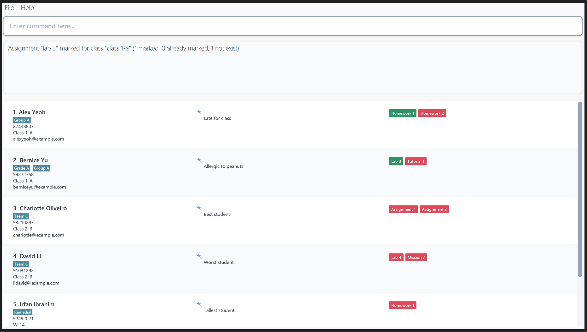

EduBook is a **desktop app for managing student details, optimized for use via a Command Line Interface** (CLI) while still having the benefits of a Graphical User Interface (GUI). If you can type fast, EduBook can get your student management tasks done faster than traditional GUI apps.

* Table of Contents
{:toc}

--------------------------------------------------------------------------------------------------------------------

## Quick start

1. Ensure you have Java `17` or above installed in your Computer. 
   **Mac users:** Ensure you have the precise JDK version prescribed [here](https://se-education.org/guides/tutorials/javaInstallationMac.html).

1. Download the latest `.jar` file from [here](https://github.com/se-edu/addressbook-level3/releases).

1. Copy the file to the folder you want to use as the _home folder_ for your AddressBook.

1. Open a command terminal, `cd` into the folder you put the jar file in, and use the `java -jar addressbook.jar` command to run the application. 
   A GUI similar to the below should appear in a few seconds. Note how the app contains some sample data. 
   

1. Type the command in the command box and press Enter to execute it. e.g. typing **`help`** and pressing Enter will open the help window. 
   Some example commands you can try:

   * `list` : Lists all contacts.

   * `add n/John Doe p/98765432 e/johnd@example.com c/Class 1-A` : Adds a student named `John Doe` to EduBook.

   * `delete 3` : Deletes the 3rd contact shown in the current list.

   * `clear` : Deletes all contacts.

   * `exit` : Exits the app.

1. Refer to the [Features](#features) below for details of each command.

--------------------------------------------------------------------------------------------------------------------

## Features

**:information_source: Notes about the command format:** 

* Words in `UPPER_CASE` are the parameters to be supplied by the user. 
  e.g. in `add n/NAME`, `NAME` is a parameter which can be used as `add n/John Doe`.

* Items in square brackets are optional. 
  e.g `n/NAME [t/TAG]` can be used as `n/John Doe t/friend` or as `n/John Doe`.

* Items with `…`​ after them can be used multiple times including zero times. 
  e.g. `[t/TAG]…​` can be used as ` ` (i.e. 0 times), `t/friend`, `t/friend t/family` etc.

* Parameters can be in any order. 
  e.g. if the command specifies `n/NAME p/PHONE_NUMBER`, `p/PHONE_NUMBER n/NAME` is also acceptable.

* Extraneous parameters for commands that do not take in parameters (such as `help`, `list`, `exit` and `clear`) will be ignored. 
  e.g. if the command specifies `help 123`, it will be interpreted as `help`.

* If you are using a PDF version of this document, be careful when copying and pasting commands that span multiple lines as space characters surrounding line-breaks may be omitted when copied over to the application.

#### Formatting rules for parameters:

| Field      | Max Length | Format / Constraints                                                                                                                                                                                 |
|------------|------------|------------------------------------------------------------------------------------------------------------------------------------------------------------------------------------------------------|
| Name       | 100        | Alphanumeric letters and spaces only; should not be blank                                                                                                                                            |
| Email      | 250        | Format: `local-part@domain` - Local-part: alphanumeric + `+`, `_`, `.`, `-`; cannot start or end with a special character - Domain: labels separated by `.`, start/end with alphanumeric, hyphens allowed internally, last label ≥2 chars |
| Phone      | 20         | Digits only, at least 3 digits long                                                                                                                                                                  |
| Class      | 20         | Any value, should not be blank                                                                                                                                                                       |
| Assignment | 100        | Alphanumeric letters and spaces only; should not be blank                                                                                                                                            |
| Tag        | none       | Alphanumeric letters                                                                                                                                                                                 | 

### Viewing help : `help`

Shows a message explaining how to access the help page.

Format: `help`

### Adding a student: `add`

Adds a student to EduBook.

Format: `add n/NAME p/PHONE_NUMBER e/EMAIL c/CLASS [t/TAG]…​`

* All inputs must adhere to the [Formatting rules for parameters](#formatting-rules-for-parameters).

:bulb: **Note:**
A student can have any number of tags (including 0)

Examples:
* `add n/John Doe p/98765432 e/johnd@example.com c/Class 1-A`
* `add n/Betsy Crowe t/friend e/betsycrowe@example.com c/Tutorial Group 2 p/1234567 t/criminal`

### Listing all students : `list`

Shows a list of all students in EduBook.

Format: `list`

### Editing a student : `edit`

Edits an existing student in the address book.

Format: `edit INDEX [n/NAME] [p/PHONE] [e/EMAIL] [c/CLASS [t/TAG]…​`

* Edits the student at the specified `INDEX`. The index refers to the index number shown in the displayed student list. The index **must be a positive integer** 1, 2, 3, …​
* At least one of the optional fields must be provided.
* Existing values will be updated to the input values.
* When editing tags, the existing tags of the student will be removed i.e adding of tags is not cumulative.
* You can remove all the student’s tags by typing `t/` without
    specifying any tags after it.

Examples:
*  `edit 1 p/91234567 e/johndoe@example.com` Edits the phone number and email address of the 1st student to be `91234567` and `johndoe@example.com` respectively.
*  `edit 2 n/Betsy Crower t/` Edits the name of the 2nd student to be `Betsy Crower` and clears all existing tags.

### Viewing a student's information: `view`

Views the information of students whose names contain any of the given keywords.

Format: `view n/NAME`

* Views the student with the specified `NAME`.
* The search is case-sensitive. e.g. `hans` will not match `Hans`.
* The order of the keywords matters. e.g. `Hans Bo` will not match `Bo Hans`.
* The full name is required for search to be successful. e.g. `Hans` will not return `Hans Bo`.
* Only the name is searched.

Examples:
* `view n/John` returns `John`
* `view n/alex david` returns `alex david`

### Deleting a student : `delete`

Deletes the specified student from Edubook.

Format 1 (by index): `delete INDEX` 

* Deletes the student at the specified `INDEX`.
* The index refers to the index number shown in the displayed student list.
* The index **must be a positive integer** 1, 2, 3, …​

Format 2 (by name): `delete n/NAME`

* Deletes the student with the exact name `NAME`
* The name is **case-sensitive** and must match exactly.

Examples:
* `list` followed by `delete 2` deletes the 2nd student in the address book.
* `find Betsy` followed by `delete 1` deletes the 1st student in the results of the `find` command.
* `delete n/John Doe` deletes the student with the exact name "John Doe"

### Assigning an assignment to a student : `assign`

Assigns a particular assignment to the specified student.

Format: `assign a/ASSIGNMENT_NAME n/NAME`

* Assigns assignment, `ASSIGNMENT_NAME`, to student with name, `NAME`.

Examples:
* `assign a/Homework n/Bob` assigns `Homework` to `Bob`
* `assign a/Tutorial 1 n/John Doe` assigns `Tutorial 1` to `John Doe`

### Assigning an assignment to a class : `assign`

Assigns a particular assignment to all students in the specified class.

Format: `assign a/ASSIGNMENT_NAME c/CLASS`

* Assigns assignment, `ASSIGNMENT_NAME`, to every student in class, `CLASS`.
* Students who already have the assignment are skipped.

Examples:
* `assign a/Homework c/Class 1-A` assigns `Homework` to all students in `Class 1-A`, skipping any student who already has it.
* `assign a/Tutorial 1 c/Tutorial Group 2` assigns `Tutorial 1` to all students in `Tutorial Group 2`, skipping any student who already has it.

### Unassigning an assignment from a student : `unassign`

Unassigns a particular assignment from the specified student.

Format: `unassign a/ASSIGNMENT_NAME n/NAME`

* Unassigns assignment, `ASSIGNMENT_NAME`, from student with name, `NAME`.

Examples:
* `unassign a/Homework n/Bob` unassigns `Homework` from `Bob`
* `unassign a/Tutorial 1 n/John Doe` unassigns `Tutorial 1` from `John Doe`

### Marking a student's assignment: `mark`

Marks a particular assignment of a specified student as completed.

Format: `mark a/ASSIGNMENT_NAME n/NAME`

* The student must exist in EduBook.
* The specified assignment must exist for the specified student.
* The specified assignment should not be already marked.

Examples:
* `mark a/Tutorial 1 n/John Doe` marks `Tutorial 1` of `John Doe` as completed.

### Clearing all entries : `clear`

Clears all entries from the address book.

Format: `clear`

### Exiting the program : `exit`

Exits the program.

Format: `exit`

### Saving the data

EduBook data are saved in the hard disk automatically after any command that changes the data. There is no need to save manually.

### Editing the data file

EduBook data are saved automatically as a JSON file `[JAR file location]/data/addressbook.json`. Advanced users are welcome to update data directly by editing that data file.

Please ensure that formatting rules are followed during manual editing.   
See [Formatting rules for parameters](#formatting-rules-for-parameters) above.

:exclamation: **Caution:**  
If your changes to the data file make its format invalid, EduBook will display an error message.  

To retain your saved file, exit immediately without making changes to the blank file. Revert the changes and reload EduBook. Otherwise, a new empty file will be used.  

Furthermore, certain edits can cause the EduBook to behave in unexpected ways (e.g., if a value entered is outside the acceptable range).  
Only edit the data file if you are confident that you can update it correctly.

### Archiving data files `[coming in v2.0]`

_Details coming soon ..._

--------------------------------------------------------------------------------------------------------------------

## FAQ

**Q**: How do I transfer my data to another Computer? 
**A**: Install the app in the other computer and overwrite the empty data file it creates with the file that contains the data of your previous EduBook home folder.

--------------------------------------------------------------------------------------------------------------------

## Known issues

1. **When using multiple screens**, if you move the application to a secondary screen, and later switch to using only the primary screen, the GUI will open off-screen. The remedy is to delete the `preferences.json` file created by the application before running the application again.
2. **If you minimize the Help Window** and then run the `help` command (or use the `Help` menu, or the keyboard shortcut `F1`) again, the original Help Window will remain minimized, and no new Help Window will appear. The remedy is to manually restore the minimized Help Window.

--------------------------------------------------------------------------------------------------------------------

## Command summary

| Action       | Format                                                                | Example                                                                            |
|--------------|-----------------------------------------------------------------------|------------------------------------------------------------------------------------|
| **Help**     | `help`                                                                | `help`                                                                             |
| **Add**      | `add n/NAME p/PHONE_NUMBER e/EMAIL c/CLASS [t/TAG]…​`                 | `add n/James Ho p/22224444 e/jamesho@example.com c/Class 10B t/friend t/colleague` |
| **List**     | `list`                                                                | `list`                                                                             |
| **Edit**     | `edit INDEX [n/NAME] [p/PHONE_NUMBER] [e/EMAIL] [c/CLASS] [t/TAG]…​`  | `edit 2 n/James Lee e/jameslee@example.com`                                        |
| **View**     | `view n/NAME`                                                         | `view n/James Lee`                                                                 |
| **Delete**   | `delete INDEX`, `delete n/NAME`                                       | `delete 3`, `delete n/John Doe`                                                    |
| **Assign**   | `assign a/ASSIGNMENT_NAME n/NAME`, `assign a/ASSIGNMENT_NAME c/CLASS` | `assign a/Tutorial 1 n/John Doe`, `assign a/Lab 2 c/Class 10B`                     |
| **Unassign** | `unassign a/ASSIGNMENT_NAME n/NAME`                                   | `unassign a/Tutorial 1 n/John Doe`                                                 |
| **Mark**     | `mark a/ASSIGNMENT_NAME n/NAME`                                       | `mark a/Tutorial 1 n/John Doe`                                                     |
| **Clear**    | `clear`                                                               | `clear`                                                                            |
| **Exit**     | `exit`                                                                | `exit`                                                                             |

