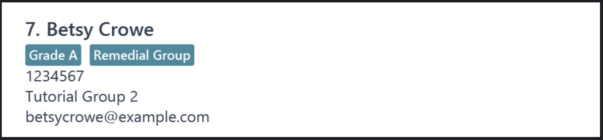
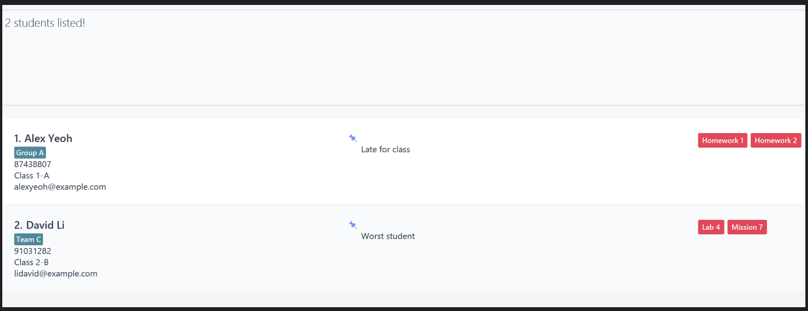
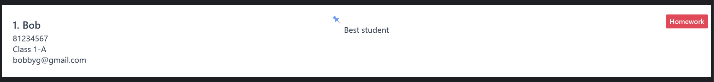
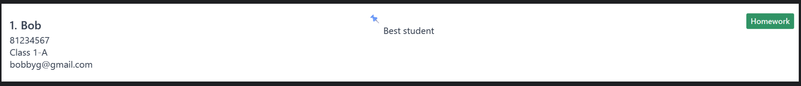

EduBook is a **desktop app for managing student details, optimized for use via a Command Line Interface** (CLI) while still having the benefits of a Graphical User Interface (GUI). If you can type fast, EduBook can get your student management tasks done faster than traditional GUI apps.

* Table of Contents
{:toc}

--------------------------------------------------------------------------------------------------------------------

## Quick start

<div markdown="span" class="alert alert-primary">
💡 <strong>Tip:</strong>  
If you just want to see all available commands quickly, jump straight to the <a href="#command-summary">Command summary</a> table.
</div>

1. Ensure you have Java `17` or above installed on your computer.<br>
   💡 **Tip:** To check your version, open a command terminal and run:

   ```bash
   java -version
   ```
   **Mac users:** Ensure you have the precise JDK version prescribed [here](https://se-education.org/guides/tutorials/javaInstallationMac.html).

2. Download the latest `.jar` file from [here](https://github.com/AY2526S1-CS2103T-W14-1/tp/releases).

3. Copy the file to the folder you want to use as the _home folder_ for your EduBook.

4. Open a command terminal, `cd` into the folder you put the jar file in, and use the `java -jar edubook.jar` command to run the application.<br>
   A GUI similar to the one below should appear in a few seconds. Note how the app contains some sample data.<br>
   

5. Type the command in the command box and press Enter to execute it. e.g. typing `help` and pressing Enter will open the help window.<br>
   Some example commands you can try:

   * `list` : Lists all students.

   * `add n/John Doe p/98765432 e/johnd@example.com c/Class 1-A` : Adds a student named `John Doe` to EduBook.

   * `delete 3` : Deletes the 3rd student shown in the current list.

   * `clear` : Deletes all students.

   * `exit` : Exits the app.

6. Refer to the [Features](#features) below for details of each command.

--------------------------------------------------------------------------------------------------------------------

## Features

<div markdown="block" class="alert alert-info">

**:information_source: Notes about the command format:**<br>

* Words in `UPPER_CASE` are the parameters to be supplied by the user.<br>
  e.g. in `add n/NAME`, `NAME` is a parameter which can be used as `add n/John Doe`.

* Items in square brackets are optional.<br>
  e.g. `n/NAME [t/TAG]` can be used as `n/John Doe t/friend` or as `n/John Doe`.

* Items enclosed in curly braces with a vertical bar (e.g. `{A | B}`) indicate that **exactly one of the options must be supplied**.<br>
  e.g. `{n/NAME | c/CLASS}` can be used as `n/John Doe` or as `c/Class 1-A`.

* Items with `…`​ after them can be used multiple times including zero times.<br>
  e.g. `[t/TAG]…​` can be used as ` ` (i.e. 0 times), `t/friend`, `t/friend t/family` etc.

* Parameters can be in any order.<br>
  e.g. if the command specifies `n/NAME p/PHONE`, `p/PHONE n/NAME` is also acceptable.

* Extraneous parameters for commands that do not take in parameters (such as `help`, `list`, `exit` and `clear`) will be ignored.<br>
  e.g. if the command specifies `help 123`, it will be interpreted as `help`.

* If you are using a PDF version of this document, be careful when copying and pasting commands that span multiple lines as space characters surrounding line-breaks may be omitted when copied over to the application.
</div>

#### Formatting rules for inputs

| Inputs     | Max Length | Format / Constraints                                                                                                                                                                                                                                                                |
|------------|------------|-------------------------------------------------------------------------------------------------------------------------------------------------------------------------------------------------------------------------------------------------------------------------------------|
| Name       | 100        | Alphanumeric letters and spaces only; must not be blank                                                                                                                                                                                                                             |
| Email      | 100        | Format: `local-part@domain`<br>- Local-part: alphanumeric + `+`, `_`, `.`, `-`; cannot start or end with a special character<br>- Domain: must include at least one `.`, with labels separated by `.`, start/end with alphanumeric, hyphens allowed internally, last label ≥2 chars |
| Phone      | 20         | Digits only, at least 3 digits long                                                                                                                                                                                                                                                 |
| Class      | 20         | Any value, must not be blank                                                                                                                                                                                                                                                        |
| Assignment | 100        | Alphanumeric letters and spaces only; must not be blank                                                                                                                                                                                                                             |
| Tag        | 20         | Alphanumeric letters and spaces only; optional to have                                                                                                                                                                                                                     | 
| Label      | 100        | Alphanumeric letters and spaces only; must not be blank                                                                                                                                                                                                                             |

<div markdown="span" class="alert alert-primary">:bulb: **Note:**
For identification purposes, all inputs are case-insensitive unless stated otherwise.
</div>

### Viewing help : `help`

Shows a message explaining how to access the help page.


Format: `help`


### Adding a student: `add`

Adds a student to EduBook.

Format: `add n/NAME p/PHONE e/EMAIL c/CLASS [t/TAG]…​`

* All inputs must adhere to the [Formatting rules for inputs](#formatting-rules-for-inputs).

<div markdown="span" class="alert alert-primary">:bulb: **Note:**
A student can have any number of tags (including 0)
</div>

Examples:
* `add n/John Doe p/98765432 e/johnd@example.com c/Class 1-A`
* `add n/Betsy Crowe t/Remedial Group e/betsycrowe@example.com c/Tutorial Group 2 p/1234567 t/Grade A`

An example of the layout is shown below:


### Listing all students : `list`

Shows a list of all students in EduBook.

Format: `list`

### Editing a student : `edit`

Edits an existing student in EduBook.

Format: `edit INDEX [n/NAME] [p/PHONE] [e/EMAIL] [c/CLASS] [l/LABEL] [t/TAG]…​ [a/ASSIGNMENT]…​`

* All edited inputs must adhere to the [Formatting rules for inputs](#formatting-rules-for-inputs).
* Edits the student at the specified `INDEX`. The index refers to the index number shown in the displayed student list. The index **must be a positive integer** 1, 2, 3, …​
* At least one of the optional fields must be provided.
* Existing values will be updated to the input values.
* When editing tags or/and assignments, the existing tags or/and assignments of the student will be removed i.e adding of tags and assignments are not cumulative.
* You can remove all the student’s tags by typing `t/` without
    specifying any tags after it.
* You can remove all the student’s assignments by typing `a/` without
    specifying any assignments after it.

Examples:
*  `edit 1 p/91234567 e/johndoe@example.com` Edits the phone number and email address of the 1st student to be `91234567` and `johndoe@example.com` respectively.
*  `edit 2 n/Betsy Crower t/` Edits the name of the 2nd student to be `Betsy Crower` and clears all existing tags.

### Viewing student information: `view`

Displays the information of a student, all students in a class or all students with an assignment, depending on the specified parameter.

Format: `view {n/NAME | c/CLASS | a/ASSIGNMENT}`

* You must specify **exactly one** of the three parameters — one of `n/NAME`, `c/CLASS` or `a/ASSIGNMENT`.  
  e.g. `view n/John Doe`, `view c/W14` or `view a/Tutorial 1`


* If `n/NAME` is used:
    * Displays the student with the specified `NAME`.
    * The search is case-insensitive. e.g. `hans` will match `Hans`.
    * The order of the keywords matters. e.g. `Hans Bo` will not match `Bo Hans`.
    * The full name is required for the search to be successful. e.g. `Hans` will not return `Hans Bo`.


* If `c/CLASS` is used:
    * Displays all students with the specified `CLASS`.
    * The search is case-insensitive. e.g. `w14` will match `W14`.
    * The order of the keywords matters. e.g. `Class 14W` will not match `14W Class`.
    * The full class name is required for the search to be successful. e.g. `W14` will not return `Class W14`.


* If `a/ASSIGNMENT` is used:
    * Displays all students with the specified `ASSIGNMENT`.
    * The search is case-insensitive. e.g. `Tutorial 1` will match `tutorial 1`.
    * The order of the keywords matters. e.g. `Tutorial 1` will not match `1 Tutorial`.
    * The full assignment name is required for the search to be successful. e.g. `1` will not return `Tutorial 1`.

Examples:
* `view n/John` — displays information of the student named `John`
* `view n/alex david` — displays information of the student named `alex david`
* `view c/Class 10B` — displays all students in the class `Class 10B`
* `view c/W14` — displays all students in the class `W14`
* `view a/Tutorial 1` — displays all students with the assignment `Tutorial 1`
* `view a/Lab 3` — displays all students with the assignment `Lab 3`

<div markdown="span" class="alert alert-primary">:bulb: **Tip:**
To restore full view, use the `list` command.
</div>

### Deleting a student : `delete`

Removes the specified student (identified by name or index) from Edubook.

Format: `delete {INDEX | n/NAME | c/CLASS}`


* You must specify **exactly one** of the three parameters — one of `INDEX`, `n/NAME` or `c/CLASS`.  
  e.g. `delete 1`, `delete n/John Doe` or `delete c/Class 10B`

* If `INDEX` is used:
    * Removes the student with the specified `INDEX`.
    * The index refers to the index number shown in the **current view**.
    * The index must be a **positive integer** 1, 2, 3, …​


* If `n/NAME` is used:
    * Removes the student with the specified `NAME`.
    * The name is case-insensitive. e.g. `hans` will match `Hans`.
    * The order of the keywords matters. e.g. `Hans Bo` will not match `Bo Hans`.
    * The full name is required for the removal to be successful. e.g. `Hans` will not return `Hans Bo`.


* If `c/CLASS` is used:
    * Removes all students with the specified `CLASS`.
    * The class is case-insensitive. e.g. `w14` will match `W14`.
    * The order of the keywords matters. e.g. `Class 14W` will not match `14W Class`.
    * The full class name is required for the removal to be successful. e.g. `W14` will not return `Class W14`.

Examples:
* `list` followed by `delete 2` deletes the 2nd student in EduBook.
* `view n/Betsy` followed by `delete 1` deletes the 1st student in the results of the `view` command.
* `delete n/John Doe` deletes the student with the exact name "John Doe"
* `delete c/Class 10B` deletes all students in the class "Class 10B"


### Locating students by name: `find`

Finds students whose names contain any of the given keywords.

Format: `find KEYWORD [MORE_KEYWORDS]…​`

* The search is case-insensitive. e.g. `hans` will match `Hans`
* The order of the keywords does not matter. e.g. `Hans Bo` will match `Bo Hans`
* Only full words will be matched. e.g. `Han` will not match `Hans`
* Students matching at least one keyword will be returned (i.e. `OR` search). e.g. `Hans Bo` will return
`Hans Gruber`, `Bo Yang`

Examples
* `find John` returns `john` and `John Doe`
* `find alex david` returns `Alex Yeoh`,`David Li`



### Assigning an assignment: `assign`

Assigns an assignment to a specific student or to all students in a class, depending on the specified parameter.

Format: `assign a/ASSIGNMENT {n/NAME | c/CLASS}`

* The format for assignment can be accessed here: [Formatting rules for inputs](#formatting-rules-for-inputs).
* You must specify **exactly one** of the two parameters — either `n/NAME` or `c/CLASS`.  
  e.g. `assign a/Homework n/Bob` or `assign a/Homework c/Class 1-A`, but not both.

* If `n/NAME` is used:
    * Assigns the assignment `ASSIGNMENT` to the student named `NAME`.
    * The student must exist in EduBook.
    * The specified student must not already have the assignment.


* If `c/CLASS` is used:
    * Assigns the assignment `ASSIGNMENT` to every student in the specified class `CLASS`.
    * Students who already have the assignment are skipped.
    * The class must exist in EduBook (i.e. there is at least one student belonging to the specified class).
    * At least one student in the specified class must not currently have the assignment.

Examples:
* `assign a/Homework n/Bob` — assigns `Homework` to `Bob`
* `assign a/Tutorial 1 n/John Doe` — assigns `Tutorial 1` to `John Doe`
* `assign a/Homework c/Class 1-A` — assigns `Homework` to all students in `Class 1-A`, skipping those who already have it
* `assign a/Tutorial 1 c/Tutorial Group 2` — assigns `Tutorial 1` to all students in `Tutorial Group 2`, skipping those who already have it

A new assignment will be unmarked by default. The assignment will be displayed to the right of the student's details and label. An
example is shown below:


### Unassigning an assignment: `unassign`

Unassigns an assignment from a specific student or from all students in a class, depending on the specified parameter.

Format: `unassign a/ASSIGNMENT {n/NAME | c/CLASS}`

* You must specify **exactly one** of the two parameters — either `n/NAME` or `c/CLASS`.  
  e.g. `unassign a/Homework n/Bob` or `unassign a/Homework c/Class 1-A`, but not both.

* If `n/NAME` is used:
    * Unassigns the assignment `ASSIGNMENT` from the student named `NAME`.
    * The student must exist in EduBook.
    * The specified assignment must exist for the specified student.


* If `c/CLASS` is used:
    * Unassigns the assignment `ASSIGNMENT` from every student in the specified class `CLASS`.
    * Students who do not have the assignment are skipped.
    * The class must exist in EduBook (i.e. there is at least one student belonging to the specified class).
    * At least one student in the specified class must currently have the assignment.

Examples:
* `unassign a/Homework n/Bob` — unassigns `Homework` from `Bob`
* `unassign a/Tutorial 1 n/John Doe` — unassigns `Tutorial 1` from `John Doe`
* `unassign a/Homework c/Class 1-A` — unassigns `Homework` from all students in `Class 1-A`, skipping those who do not have it
* `unassign a/Tutorial 1 c/Tutorial Group 2` — unassigns `Tutorial 1` from all students in `Tutorial Group 2`, skipping those who do not have it

After unassigning an assignment, the assignment will no longer be displayed to the right of the student's details and label. 
For example, using the command `unassign n/Bob a/Homework`, the "Homework" assignment will no longer be displayed as shown below.


### Marking an assignment: `mark`

Marks an assignment as completed for a specific student or for all students in a class, depending on the specified parameter.

Format: `mark a/ASSIGNMENT {n/NAME | c/CLASS}`

* You must specify **exactly one** of the two parameters — either `n/NAME` or `c/CLASS`.  
  e.g. `mark a/Homework n/Bob` or `mark a/Homework c/Class 1-A`, but not both.

* If `n/NAME` is used:
    * Marks the assignment `ASSIGNMENT` of the student named `NAME` as completed.
    * The student must exist in EduBook.
    * The specified assignment must exist for the specified student.
    * The specified assignment must not already be marked.


* If `c/CLASS` is used:
    * Marks the assignment `ASSIGNMENT` as completed for every student in the specified class `CLASS`.
    * Students who do not have the assignment or whose assignment is already marked are skipped.
    * The class must exist in EduBook (i.e. there is at least one student belonging to the specified class).
    * At least one student in the specified class must currently have the assignment unmarked.

Examples:
* `mark a/Tutorial 1 n/John Doe` — marks `Tutorial 1` of `John Doe` as completed
* `mark a/Homework n/Bob` — marks `Homework` of `Bob` as completed
* `mark a/Tutorial 1 c/Class 1-A` — marks `Tutorial 1` as completed for all students in `Class 1-A`, skipping those who do not have the assignment or whose assignment is already marked
* `mark a/Homework c/Tutorial Group 2` — marks `Homework` as completed for all students in `Tutorial Group 2`, skipping those who do not have the assignment or whose assignment is already marked

Upon successful marking, the assignment should turn green as shown:


### Unmarking an assignment: `unmark`

Unmarks an assignment as not completed for a specific student or for all students in a class, depending on the specified parameter.

Format: `unmark a/ASSIGNMENT {n/NAME | c/CLASS}`

* You must specify **exactly one** of the two parameters — either `n/NAME` or `c/CLASS`.  
  e.g. `unmark a/Homework n/Bob` or `unmark a/Homework c/Class 1-A`, but not both.

* If `n/NAME` is used:
  * Unmarks the assignment `ASSIGNMENT` of the student named `NAME` as not completed.
  * The student must exist in EduBook.
  * The specified assignment must exist for the specified student.
  * The specified assignment must not already be unmarked.  


* If `c/CLASS` is used:
  * Unmarks the assignment `ASSIGNMENT` as not completed for every student in the specified class `CLASS`.
  * Students who do not have the assignment or whose assignment is already unmarked are skipped.
  * The class must exist in EduBook (i.e. there is at least one student belonging to the specified class).
  * At least one student in the specified class must currently have the assignment marked.

Examples:
* `unmark a/Tutorial 1 n/John Doe` — unmarks `Tutorial 1` of `John Doe` as not completed
* `unmark a/Homework n/Bob` — unmarks `Homework` of `Bob` as not completed
* `unmark a/Tutorial 1 c/Class 1-A` — unmarks `Tutorial 1` as not completed for all students in `Class 1-A`, skipping those who do not have the assignment or whose assignment is already unmarked
* `unmark a/Homework c/Tutorial Group 2` — unmarks `Homework` as not completed for all students in `Tutorial Group 2`, skipping those who do not have the assignment or whose assignment is already unmarked

Upon successful unmarking, the assignment will revert to red colour as shown:


### Apply a label: `label`

Applies a label to a specific student or to all students in a class, depending on the specified parameter.

Format: `label l/LABEL {n/NAME | c/CLASS}`

* The format for label can be accessed here: [Formatting rules for inputs](#formatting-rules-for-inputs).
* You must specify **exactly one** of the two parameters — either `n/NAME` or `c/CLASS`.  
  e.g. `label l/Top student n/Bob` or `label l/Online Meeting c/Class 1-A`, but not both.

* If `n/NAME` is used:
    * Applies the label `LABEL` to the student named `NAME`.
    * The student must exist in EduBook.
    * The student must not have a current label.


* If `c/CLASS` is used:
    * Applies the label `LABEL` to every student in the specified class `CLASS`.
    * The class must exist in EduBook (i.e. there is at least one student belonging to the specified class).
    * At least one student in the class must not have a current label. 

Examples:
* `label l/Top student n/Bob` — applies `Top student` to `Bob`
* `label l/Latecomer n/John Doe` — applies `Latecomer` to `John Doe`
* `label l/Online class c/Class 1-A` — applies `Online class` to all students in `Class 1-A`
* `label l/Remedial c/Tutorial Group 2` — assigns `Remedial` to all students in `Tutorial Group 2`

### Removing a label: `unlabel`

Removes a label from a specific student or from all students in a class, depending on the specified parameter.

Format: `unlabel {n/NAME | c/CLASS}`

* You must specify **exactly one** of the two parameters — either `n/NAME` or `c/CLASS`.  
  e.g. `unlabel n/Bob` or `unlabel c/Class 1-A`, but not both.

* If `n/NAME` is used:
    * Removes the label from the student named `NAME`.
    * The student must exist in EduBook.
    * The student must have a label.


* If `c/CLASS` is used:
    * Removes the label from every student in the specified class `CLASS`.
    * The class must exist in EduBook (i.e. there is at least one student belonging to the specified class).
    * At least one student in the class must have a label.

Examples:
* `unlabel n/Bob` — removes any label from `Bob`
* `unlabel n/John Doe` — removes any label from `John Doe`
* `unlabel c/Class 1-A` — removes any label from all students in `Class 1-A`
* `unlabel c/Tutorial Group 2` — removes any label from all students in `Tutorial Group 2`

### Clearing all entries : `clear`

Clears all entries from EduBook.

Format: `clear`

### Exiting the program : `exit`

Exits the program.

Format: `exit`

### Saving the data

EduBook data is saved in the hard disk automatically after any command that changes the data. There is no need to save manually.

### Editing the data file

EduBook data is saved automatically as a JSON file `[JAR file location]/data/edubook.json`. Advanced users are welcome to update data directly by editing that data file.

Please ensure that formatting rules are followed during manual editing.   
See [Formatting rules for inputs](#formatting-rules-for-inputs) above.

<div markdown="span" class="alert alert-warning">
:exclamation: **Caution:**  
If your changes to the data file make its format invalid, EduBook will display an error message.  

To retain your saved file, exit immediately without making changes to the blank file. Revert the changes and reload EduBook. Otherwise, a new empty file will be used. The new file **will be saved** upon using the `exit` command or making changes to the file, **erasing the old file**.


Furthermore, certain edits can cause the EduBook to behave in unexpected ways (e.g., if a value entered is outside the acceptable range).  
Only edit the data file if you are confident that you can update it correctly.
</div>


### Archiving data files `[coming in v2.0]`

_Details coming soon ..._

--------------------------------------------------------------------------------------------------------------------

## FAQ

**Q**: How do I transfer my data to another Computer?<br>
**A**: Install the app in the other computer and overwrite the empty data file it creates with the file that contains the data of your previous EduBook home folder. <br>

**Q**: How do I restore to full view after doing `view`? <br>
**A**: Use the `list` command to restore full view. <br>

**Q**: How do I restore my data if I accidentally used `clear`? <br>
**A**: Unfortunately, there is no command to undo the `clear` command. 
We recommend saving a backup file as a precaution to prevent future incidents.


--------------------------------------------------------------------------------------------------------------------

## Known issues

1. **When using multiple screens**, if you move the application to a secondary screen, and later switch to using only the primary screen, the GUI will open off-screen. The remedy is to delete the `preferences.json` file created by the application before running the application again.
2. **If you minimize the Help Window** and then run the `help` command (or use the `Help` menu, or the keyboard shortcut `F1`) again, the original Help Window will remain minimized, and no new Help Window will appear. The remedy is to manually restore the minimized Help Window.

--------------------------------------------------------------------------------------------------------------------

## Command summary

| **Command**                                         | **Format**                                                                               | **Example**                                                                         |
|-----------------------------------------------------|------------------------------------------------------------------------------------------|-------------------------------------------------------------------------------------|
| [**Help**](#viewing-help--help)                     | `help`                                                                                   | `help`                                                                              |
| [**Add**](#adding-a-student-add)                    | `add n/NAME p/PHONE e/EMAIL c/CLASS [t/TAG]…​`                                           | `add n/James Ho p/22224444 e/jamesho@example.com c/Class 10B t/Team A t/Grade B`    |
| [**List**](#listing-all-students--list)             | `list`                                                                                   | `list`                                                                              |
| [**Edit**](#editing-a-student--edit)                | `edit INDEX [n/NAME] [p/PHONE] [e/EMAIL] [c/CLASS] [l/LABEL] [t/TAG]…​ [a/ASSIGNMENT]…​` | `edit 2 n/James Lee e/jameslee@example.com`                                         |
| [**View**](#viewing-student-information-view)       | `view {n/NAME                                                                            | c/CLASS}`                                                     | `view n/James Lee`, `view c/Class-B`                                               |
| [**Delete**](#deleting-a-student--delete)           | `delete {INDEX                                                                           | n/NAME}`                                                    | `delete 3`, `delete n/John Doe`                                                   |
| [**Find**](#locating-students-by-name-find)         | `find KEYWORD [MORE_KEYWORDS]…​`                                                           | `find alex`, `find alex david`                                                    |
| [**Assign**](#assigning-an-assignment-assign)       | `assign a/ASSIGNMENT_NAME {n/NAME                                                        | c/CLASS}`                               | `assign a/Tutorial 1 n/John Doe`, `assign a/Lab 2 c/Class 10B`                      |
| [**Unassign**](#unassigning-an-assignment-unassign) | `unassign a/ASSIGNMENT_NAME {n/NAME                                                      | c/CLASS}`                            | `unassign a/Tutorial 1 n/John Doe`, `unassign a/Lab 2 c/Class 10B`                  |
| [**Mark**](#marking-an-assignment-mark)             | `mark a/ASSIGNMENT_NAME {n/NAME                                                          | c/CLASS}`                               | `mark a/Tutorial 1 n/John Doe`, `mark a/Lab 2 c/Class 10B`                          |
| [**Unmark**](#unmarking-an-assignment-unmark)       | `unmark a/ASSIGNMENT_NAME {n/NAME                                                        | c/CLASS}`                            | `unmark a/Tutorial 1 n/John Doe`, `unmark a/Lab 2 c/Class 10B`                      |
| [**Label**](#apply-a-label-label)                   | `label l/LABEL {n/NAME                                                                   | c/CLASS}`                                      | `label l/Top student n/John Doe`, `label l/Online class c/Class 10B`                |
| [**Unlabel**](#removing-a-label-unlabel)            | `unlabel {n/NAME                                                                         | c/CLASS}`                                           | `unlabel n/John Doe`, `unlabel c/Class 10B`                                         |
| [**Clear**](#clearing-all-entries--clear)           | `clear`                                                                                  | `clear`                                                                             |
| [**Exit**](#exiting-the-program--exit)              | `exit`                                                                                   | `exit`                                                                              |
